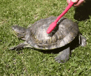

<h1 align = "center">👁👄👁 SIMPLY ISAC 👁👄👁</h1>

~~~js
const IsacLunaVazquez ={
   pronouns: "He"|"Him"
   code: [Only C]
   learning: [Python]
   hobbies: See series jiji
 }
~~~

 

<h3 align = "left" style = "text-align : justify;">Hiiiii! 🦔, I'm Isac and I'm studying Science Computer. I want to learn more about of the programming languajes and IA. </h3>
<h3 align = "left" style = "text-align : justify;">This is something I'm changing with a lot of frecuency hehe.</h3>
<h3 align = "left" style = "text-align : justify;">Also I'm studying English so, if you see something bad in this text, please say me.</h3>

 

### I'm Listening to: 

### Code & Tools

 

### Enlaces

   

